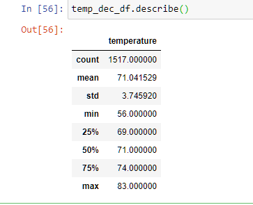
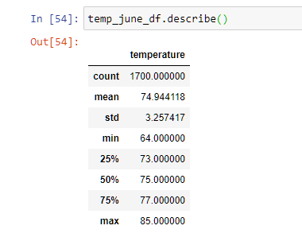
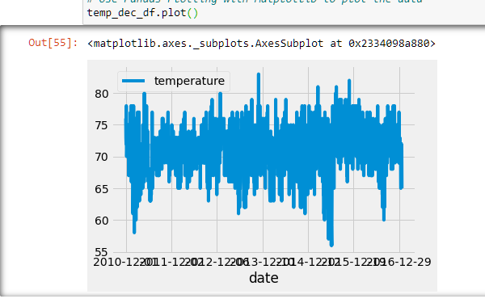
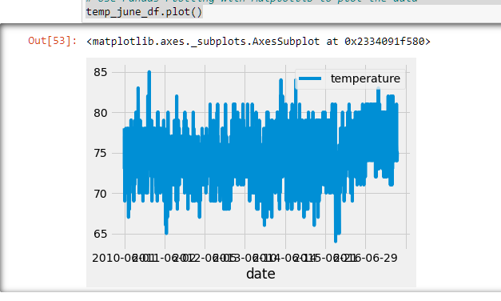
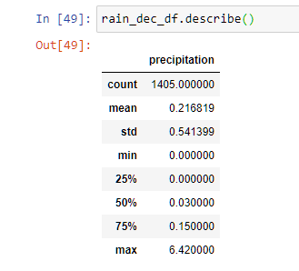
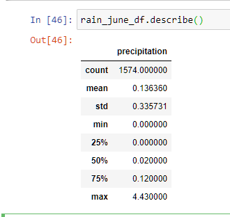
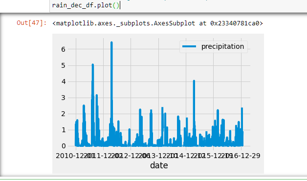
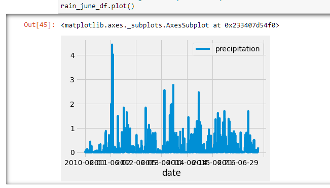

# surfs_up

I extracted all measurements of temperature from every day that fell in the months of December and June. The average temperature in Dec was 71.04F. The average temperature in June was not much higher at 74.94. There was a larger difference in the minimum temperatures: June = 64F and Dec = 56F. Maximum temps were almost the same: June = 85F and Dec = 83F. Suggested further analysis would be how many days above 80F degrees and how many days below 60F. This would give us more insight on consistancy of weather in each month.

In these chart you can see visiually the approximate 10 degree difference in the lower temperatures.

It rains slightly more in December that June: Average in Dec = 0.22" and Average in June = 0.14". The max fall in dec was 6.42". The max fall in June was 4.43". They both had minimums of 0 (measured per day). Suggested further analysis would be how many days did it rain equal to more than one inch.

In the charts you can visibly see the approximate two inch difference between the two months. Decemember has more day over two inches than does June.
